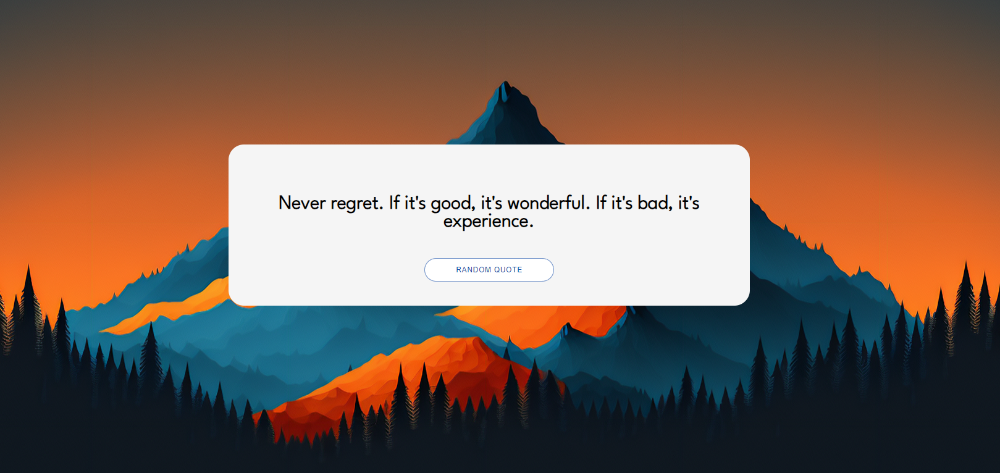

# Random Quote Generator

A simple React web application that fetches and displays random quotes.

## Demo

## Features

- Display a new random quote on each request.
- Refresh button to fetch a new quote.

## Technologies Used

- React
- JavaScript
- CSS
- [Advice Slip API](https://api.adviceslip.com/)

## Installation

1. Clone the repository:
   git clone https://github.com/your-username/random-quote-generator.git

2. Navigate to the project directory:
    cd random-quote-generator
3. Install dependencies:
    npm install

4. Start the development server:
    npm start

5. Open your browser and visit 
    http://localhost:3000.
